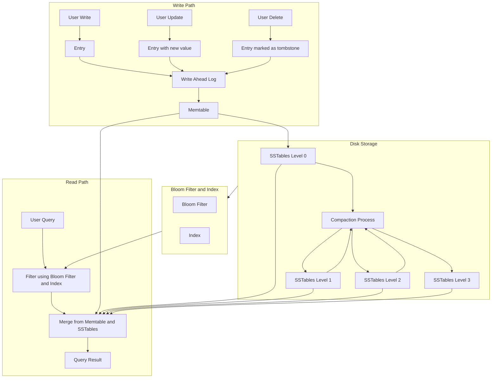

# LSM Tree Python Implementation — Technical Requirements Document

_Last updated: 2025-10-24_

## 1. Overview

This document defines the **functional requirements**, **acceptance criteria**, **edge cases**, and **non-goals** for the Python implementation of an **LSM Tree (Log-Structured Merge Tree)** system.

It is based on the following architectural model:

---

## 2. System Description

### Purpose

The LSM Tree is a high-throughput, write-optimized key-value storage engine.  
This implementation targets educational and research usage, with extensibility for experimentation in compaction strategies, storage formats, and caching policies.

### Goals

- Modular, pluggable architecture.
- Crash-consistent and recoverable persistence model.
- Support for point and range queries.
- Accurate, repeatable performance measurements.

---

## 3. Functional Requirements

### 3.1 Write Path

#### Description
Handles insertion, updates, and deletions of key-value pairs, ensuring durability and ordering guarantees.

#### Requirements
1. **Write Ahead Log (WAL)**  
   - All mutations must be appended to the WAL before being acknowledged.  
   - WAL records must be recoverable after process crash.

2. **Memtable**  
   - Must maintain sorted in-memory data structure.  
   - Flushed to SSTables when size threshold exceeded.  
   - Should allow concurrent reads while writes occur.

3. **Tombstone handling**  
   - Deletions must record tombstone entries.  
   - Tombstones are preserved until compaction clears expired ones.

4. **Flush policy**  
   - Flush Memtable to disk when memory usage exceeds `memtable_max_bytes`.  
   - Write operations must continue after flush by switching to a new Memtable.

---

### 3.2 Read Path

#### Description
Supports efficient retrieval of values using point lookups or range scans.

#### Requirements
1. **Read algorithm**  
   - Query must check Memtable first, then SSTables in ascending level order.  
   - Bloom filters and indexes should prune unnecessary I/O.

2. **Merge read**  
   - For overlapping SSTables, results are merged by key, using the most recent timestamp.

3. **Tombstone awareness**  
   - Reads must respect tombstones (i.e., deleted keys return `None`).

4. **Range queries**  
   - Return sorted sequence of `(key, value)` pairs.  
   - Include filtering of deleted keys.

---

### 3.3 Disk Storage

#### Description
SSTables store immutable sorted data files, organized in levels.  
Compaction merges and rebalances SSTables periodically.

#### Requirements
1. **SSTable immutability**  
   - Once written, SSTables must not be modified.

2. **Compaction process**  
   - Periodically merge overlapping SSTables from lower levels into higher levels.  
   - Remove duplicates and obsolete tombstones.

3. **Metadata tracking**  
   - Maintain manifest or registry tracking SSTables and their levels.

4. **Crash safety**  
   - Metadata updates and file operations must be atomic.

---

### 3.4 Indexing and Filtering

#### Description
Speed up key lookups using Bloom filters and on-disk indexes.

#### Requirements
1. **Bloom Filter**  
   - False-positive rate ≤ configured threshold (default 1%).  
   - Stored alongside each SSTable.

2. **Index**  
   - Maps key ranges to file offsets for efficient seeks.  
   - Should allow binary search or approximate positioning.

---

### 3.5 Compaction

#### Description
Background or manual process that merges SSTables to maintain storage efficiency.

#### Requirements
1. **Correctness**  
   - For any key, only the latest value (or tombstone) should remain after compaction.

2. **Concurrency**  
   - Compaction must not block readers.  
   - File registration and replacement must be atomic.

3. **Resource control**  
   - Limit number of concurrent compactions.  
   - Support manual triggering for testing.

---

## 4. Acceptance Criteria

1. **Data Durability**  
   - After a crash and recovery, all acknowledged writes must be readable.

2. **Data Consistency**  
   - For any given key, the returned value must correspond to the highest timestamped entry.

3. **Read Correctness**  
   - Reads must return correct results, respecting deletions and recency.

4. **Performance**  
   - Write throughput should exceed that of a simple B-Tree under sequential inserts.  
   - Range scans should perform within O(n) of total key range scanned.

5. **Compaction Validity**  
   - No key duplication post-compaction.  
   - Expired tombstones are purged.

6. **Recovery**  
   - Recovery process reconstructs the Memtable from WAL in correct order.

7. **Bloom Filter Accuracy**  
   - Observed false-positive rate ≤ 2× theoretical rate.

---

## 5. Edge Cases

| Case | Description | Expected Behavior |
|------|--------------|------------------|
| **Crash during write** | WAL partially written | Recovery replays complete records only |
| **Memtable flush while writing** | Writer active during flush | Writes switch to new Memtable instance |
| **Duplicate timestamp** | Two updates with same timestamp | Last writer wins (deterministic order) |
| **Empty value insert** | Insert with `b""` | Stored as valid value, not tombstone |
| **Large key/value** | Exceeds SSTable block size | Split into multiple blocks |
| **Tombstone + reinsert** | Delete followed by put | Reinsert overwrites tombstone with higher ts |
| **Corrupted WAL record** | Invalid checksum | Record skipped and error logged |
| **Missing SSTable index** | Index file missing | SSTable rebuilt or skipped with warning |
| **Compaction interrupted** | Power failure | Temporary files detected and cleaned on restart |

---

## 6. Non-Goals

1. **Distributed replication** — This design targets a single-node implementation.  
2. **Transactions / multi-key atomicity** — Each write applies to a single key only.  
3. **Snapshots / MVCC** — No multi-version query support.  
4. **External compression** — Only lightweight block compression is considered.  
5. **Encryption** — Not part of the baseline implementation.  
6. **Secondary indexing** — Only primary key lookups supported.

---

## 7. Extensibility Requirements

- Components (WAL, Memtable, SSTable, Compaction, etc.) must expose **clear interfaces**.
- New backends (e.g., SQLite-based SSTables) must be pluggable via shared interface.
- AI agents must be able to independently implement and test each component based on the interface contract.

---

## 8. Performance Benchmarks (Informative)

| Operation | Expected Complexity | Target Throughput (Baseline) |
|------------|--------------------|-------------------------------|
| Insert / Update | O(1) amortized | ≥ 100k ops/sec |
| Delete | O(1) amortized | ≥ 100k ops/sec |
| Get (Point Lookup) | O(log N) | ≤ 1ms for hot keys |
| Range Scan | O(N + M) | Linear in number of results |
| Compaction | O(N log N) | Dependent on level size |

---

## 9. Implementation Notes

- Use append-only WAL and atomic renames for safety.  
- Prefer sequential I/O for SSTable writes and compactions.  
- Include internal metrics (write throughput, read latency, compaction time).  
- Must support deterministic testing with fixed timestamps.

---

## 10. Deliverables

1. Functional modules per component (WAL, Memtable, SSTable, Compaction, Index, BloomFilter, LSMStore).  
2. Unit tests and integration tests covering edge cases.  
3. Documentation for setup, configuration, and usage.  
4. Benchmarks comparing write performance vs B-Tree baseline.  
5. Recovery demonstration test (crash + restart).

---

_End of document._
